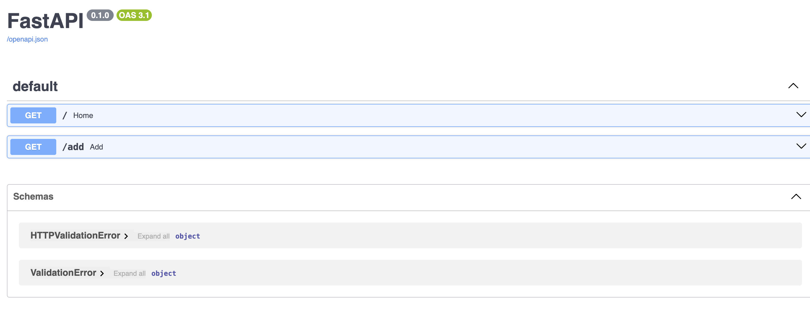
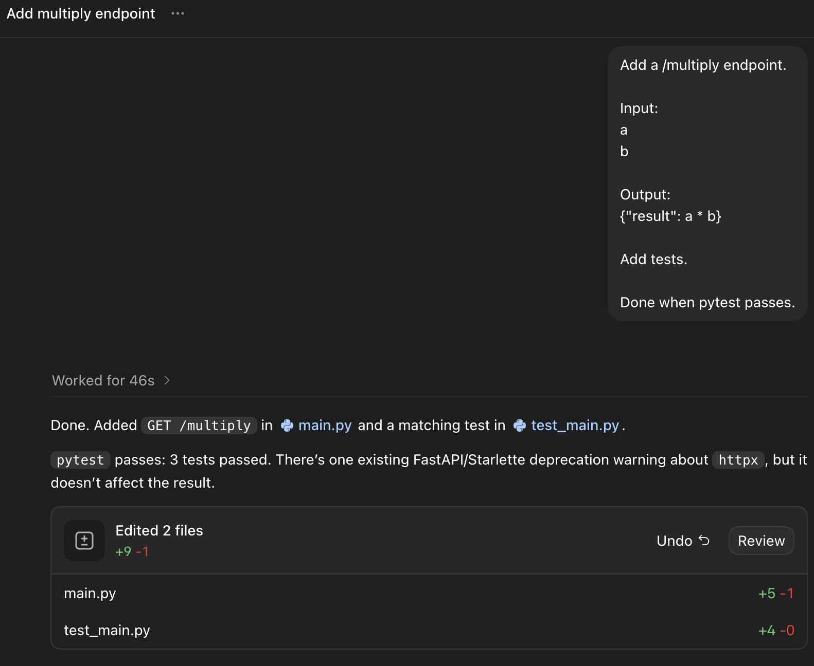
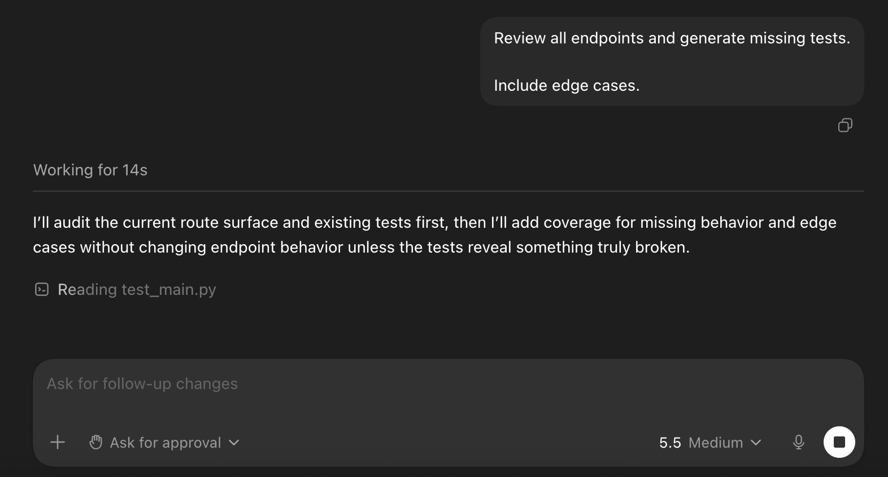
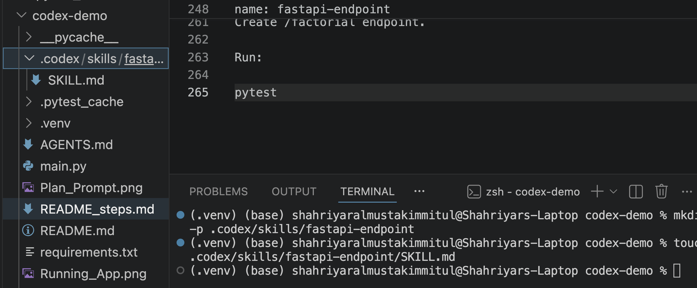

# Create a Test Project on macOS

### Open Terminal and run:
```
mkdir codex-demo
cd codex-demo
```

### Create a Python virtual environment:
```
python3 -m venv .venv
```
### Activate it:
```
source .venv/bin/activate
```
### You should see:
```
(.venv) %
```
### Install dependencies:
```
pip install fastapi uvicorn pytest httpx
```

# Install Codex CLI on macOS

Using Homebrew:
```
brew install --cask codex
```
Or npm:
```
npm install -g @openai/codex
```
Verify:
```
codex --version
```
Login:
```
codex login
```
Start Codex:
```
codex
```


### Create the Project Files in VS Code

Create:
```
touch main.py
touch test_main.py
code .
```


### Save the main.py file

```
from fastapi import FastAPI

app = FastAPI()

@app.get("/")
def home():
    return {"message": "Hello from Codex demo"}

@app.get("/add")
def add(a: int, b: int):
    return {"result": a + b}

```

## Save the test_main.py

```
from fastapi.testclient import TestClient
from main import app

client = TestClient(app)

def test_home():
    response = client.get("/")
    assert response.status_code == 200
    assert response.json() == {"message": "Hello from Codex demo"}

def test_add():
    response = client.get("/add?a=2&b=3")
    assert response.status_code == 200
    assert response.json() == {"result": 5}
```


### Install test dependencies:

```
pip install pytest httpx
```

### Start FastAPI:
```
uvicorn main:app --reload
```
### Open in browser:

http://127.0.0.1:8000
Run Tests on macOS



```
pytest
```


(Note : if the port is in use, check the workid lsof -i :8000, then kill the task : kill <taskID>)


# Test 1: Code Generation

Inside Codex:

Add a /multiply endpoint.

```
Input:
a
b

Output:
{"result": a * b}

Add tests.

Done when pytest passes.
```



Run:
```
pytest
```


## Test 2: Plan Mode

In Codex App:


Press:
```

Shift + Tab
```

Prompt
```

Create a plan for adding JWT authentication to this FastAPI app.

Do not write code yet.
```


## Unit Test Generation

Ask in Codex:
```
Review all endpoints and generate missing tests.

Include edge cases.
```

Run:

```

pytest
```


## Documentation

```
Ask:

Generate README.md.

Include:
- Installation
- Running
- Endpoints
- Examples

```

Open:

cat README.md

Verify instructions are correct.


## Test 6: AGENTS.md

Create:
```

touch AGENTS.md
```

Example:

# AGENTS.md
```
Rules:

- Every endpoint must have tests.
- Use type hints.
- Return JSON.
- Run pytest before completing.
```

Ask:

```
Read AGENTS.md.

Add a /power endpoint.

```

Verify:

```

pytest
```


## Skills

Create folder:
```
mkdir -p .codex/skills/fastapi-endpoint
```
Create:
```
touch .codex/skills/fastapi-endpoint/SKILL.md
```
Add this in the SKILL.md file:



```
---
name: fastapi-endpoint
description: Create FastAPI endpoints with tests
---

1. Create endpoint.
2. Add tests.
3. Update docs.
4. Verify pytest passes.

```

Ask Codex:
```
Use $fastapi-endpoint.

Create /factorial endpoint.
```

Run:
```
pytest
```


## Apps / MCPs

A simple beginner test on macOS:

Create:
```
touch ticket.txt
```

Add in the ticket.txt file:
```
Task:
Create /health endpoint.

Expected:
{"status":"ok"}

Add tests.
```

Ask Codex:
```

Read ticket.txt and implement the task.

```

Run:


```
pytest
```